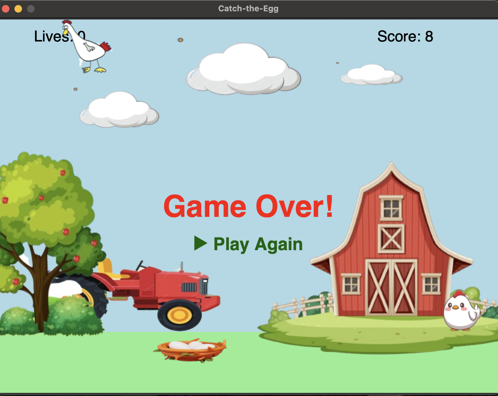

# 🥚 Catch-the-Egg Game 🎮

A fun and interactive egg-catching game made with **Python Tkinter**! Move the basket left and right to catch falling eggs from the hen. Miss three eggs and it’s game over!

---

## 🖼️ Game Preview

> Catch eggs, score points, and enjoy a farm-themed background with barns, trees, tractors, and clouds.



---

## 🚀 Features

- 🐔 Moving hen that drops eggs at random intervals  
- 🧺 Basket controlled with Left/Right arrow keys  
- 💥 Catch the egg to score points  
- ❤️ You lose a life if you miss an egg  
- 🕹️ "Play" and "Play Again" buttons  
- 🎨 Beautiful farm-themed graphics  
- 🔁 Animated game over flashing effect  
- 🏁 Score bouncing animation on catch  

---

## 🛠️ Requirements

- Python 3.x  
- Required Python libraries:
  - `tkinter` (comes with Python)
  - `Pillow` (for image processing)

---

## ▶ How to Run

Simply execute the `main.py` file:

```bash
python main.py
```

Use:
- ⬅️ Left Arrow to move the basket left  
- ➡️ Right Arrow to move the basket right  
- Click the "▶ Play" or "▶ Play Again" button to start/restart the game

---

## 📝 Code Structure

- `main.py` – All logic and UI for the game
- `Images/` – Folder containing all game assets
- `README.md` – Project info and instructions

---

## 💡 Future Ideas

- Add sound effects 🎵  
- Introduce levels or increasing difficulty  
- Add high score tracking  
- Web-based version using JavaScript or PyScript  

---

## 📄 License

This project is for educational and personal use. Feel free to modify and build upon it.

---

## 👩‍💻 Author

Made with ❤️ by [Vanshika]  
Feel free to [connect](mailto:vs905snu@email.com)!
